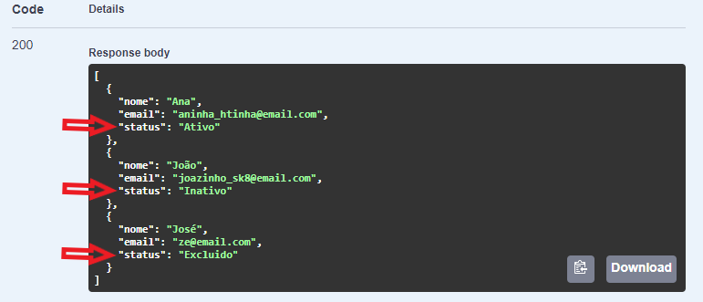

# Como retornar a string de um enum em uma API .NET 

## Introdução
Por padrão API's .NET retornam o indices de enumeradores(enum) mas nem sempre esse é o cenario ideal de retorno, para algumas situações desejamos retornar a string do enumerador, o .NET oferece a opção de serializar valores enum como strings.

Neste artigo vou crair um exemplo de API que retorna a string de enumeradores.

## Pré-requisitos

+ .NET 6.0
+ Visual Studio Code (VS Code)
+ Terminal de sua preferência

## Criando o projeto
Com o comando **`dotnet new webapi`** vamos criar um projeto webapi, o parâmetro **`-o`** indica o diretorio onde o projeto será criado.

    dotnet new webapi -o exemplo-dotnet-enum

Para esse exemplo não vamos precisar dos arquivos **`WeatherForecast.cs`** e **`WeatherForecastController.cs`** os mesmos podem ser deletados.

Vamos criar tres novos arquivos, **`StatusClienteEnum.cs`**, **`Cliente.cs`** e **`ClienteController.cs`** os mesmos serão criados em pastas separadas para uma minima organização.

Enums/StatusClienteEnum.cs

```cs
namespace exemplo_dotnet_enum.Enums
{
    public enum StatusClienteEnum
    {
        Ativo,
        Inativo,
        Excluido
    }
}
```

Models/Cliente.cs
```cs
using exemplo_dotnet_apienum.Enums;

namespace exemplo_dotnet_apienum.Models
{
    public class Cliente
    {
        public string Nome { get; set; }
        public string Email { get; set; }
        public StatusClienteEnum Status { get; set; }
        
        public Cliente(string nome, string email, StatusClienteEnum status)
        {
            Nome = nome;
            Email = email;
            Status = status;
        }
    }
}
```

Controllers/ClienteController.cs
```cs
using exemplo_dotnet_enum.Enums;
using exemplo_dotnet_enum.Models;
using Microsoft.AspNetCore.Mvc;

namespace exemplo_dotnet_enum.Controllers
{
    [ApiController]
    [Route("[controller]")]
    public class ClienteController : Controller
    {

        [HttpGet(Name = "GetCliente")]
        public IEnumerable<Cliente> Get()
        {
            return new List<Cliente>()
            {
                new Cliente("Ana", "aninha_htinha@email.com", StatusClienteEnum.Ativo),
                new Cliente("João", "joazinho_sk8@email.com", StatusClienteEnum.Inativo),
                new Cliente("José", "ze@email.com", StatusClienteEnum.Excluido),
            };
        }
    }
}
```

Feito isso podemos executar nossa api observer em qual porta esta rodando e acesse o swagger, no exemplo estou acessando o seguinte endereço **``https://localhost:7151/swagger/index.html ``**

Executando a rota Get/Cliente nossa API retorna os clientes, mas ainda não temos o resultado esperado pois esta sendo retornado o indice dos enums.


Para o .NET 6 precisamos mudar a classe **``Program.cs``** adicionando a extensão **``AddJsonOptions()``** em **``builder.Services.AddControllers()``** essa estesão vai nos permitir configurar as opções do serializador JSON usadas pelos controllers.
*(se você estiver utilizando o .NET 5 as mudanças devem ser feitas no arquivo **``Startup.cs``**)*

```cs
builder.Services.AddControllers().AddJsonOptions(x =>
{
    x.JsonSerializerOptions.Converters.Add(new JsonStringEnumConverter());
});
```
A classe **``JsonStringEnumConverter``** precisa da referencia **``using System.Text.Json.Serialization``**. No final o **``Program.cs``** ficará assim

```cs
using System.Text.Json.Serialization;

var builder = WebApplication.CreateBuilder(args);

builder.Services.AddControllers().AddJsonOptions(x =>
{
    x.JsonSerializerOptions.Converters.Add(new JsonStringEnumConverter());
});

builder.Services.AddEndpointsApiExplorer();
builder.Services.AddSwaggerGen();

var app = builder.Build();

if (app.Environment.IsDevelopment())
{
    app.UseSwagger();
    app.UseSwaggerUI();
}

app.UseHttpsRedirection();

app.UseAuthorization();

app.MapControllers();

app.Run();
```

Vamos executar novamente nossa api e teremos o seguinte resultado




## Conclusão
O metodo **``AddJsonOptions``** nos permite configurar as opções para serializar JSON, e por padrão os enums são serializados como numeros, para serializar os enums como texto (string) utlizamos o a classe **``JsonStringEnumConverter``** como parametro do metodo **``JsonSerializerOptions.Converters.Add()``**. Fica essa dica para quando queremos expor o texto de enumeradores.  

